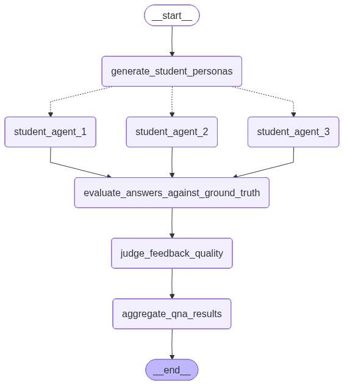

# opitco-agents
Testing set up for multi agent for Opitco case in EUSAiR 

## About the experiment
This experiment simulates a user survey experiment to evaluate the AI evaluator system. This repository provides details on how we would set up such experiment. 
We set up multi-agents system to simulate various style of students' answers and thus, feed these answers to the AI evaluator system. The feedback from the AI evaluator will be judged and scored by a judge LLM agent. 

## Testing scope
- The experiment focuses on the aspect of Fairness and Robustness of the system.
- The generated students personas are defined by certain categories:
    - Age
    - Learning style
    - Motivation profile
    - Engagement level
    - Learning challenges
- Currently, we aim to use LLM-as-a-judge to conduct the evaluating process. The metrics will be provied detailedly. 

## Set up

### Tech stack
- Langgraph, langchain
- uv
- Aitta backend API from CSC
- LLM in PoC: GPT OSS 120B

## Dataset
- 
## Evaluation Framework

We evaluate the system Performance across the following dimensions

### Accuracy
- Maintain consistency in only giving out feedback and not final score
- Provide helpful feedback with no direct correct answer

### Robustness
- Paraphrase consistency (performance under reworded questions)
- Noise robustness (handling typos and incomplete inputs)
- Score stability under input variation

### Fairness
- Persona score gap (difference in grading across student personas)
- Same-answer bias (checking if identical answers receive different scores)
- Error rate parity across personas

### Consistency
- Score variance across repeated evaluations

## TODOs
- [ ] Looping agentic system 
- [x] Setting up the datasets
- [x] Setting up the evaluation  
- [ ] Evaluating the LLM-as-a-judge and setting up system prompt